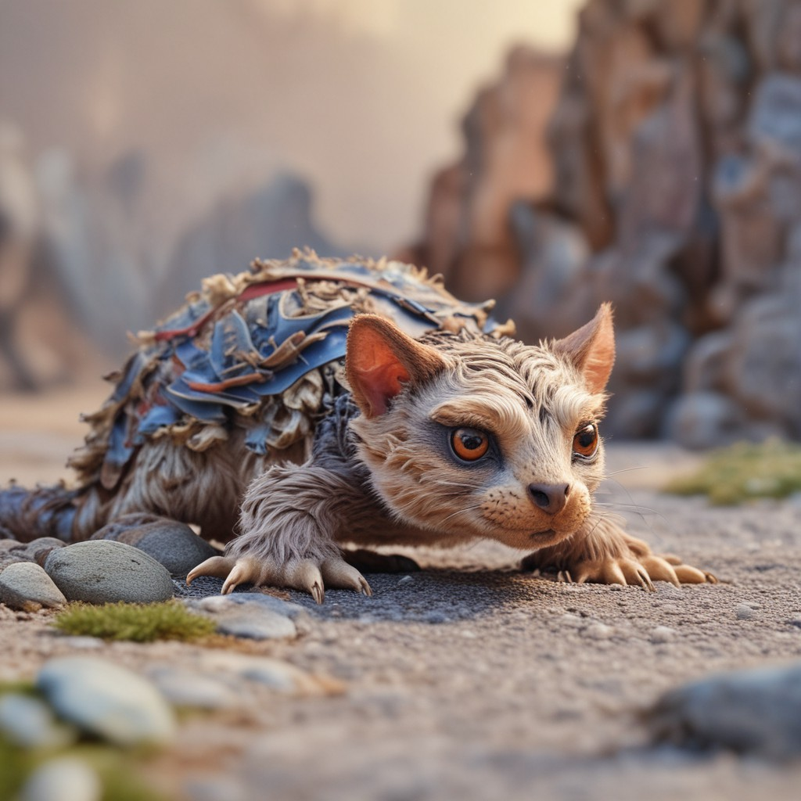

# Teaching the World Artbreeder: An In-Depth Guide

## Table of Contents
1. [Introduction](#introduction)
2. [Artbreeder Features](#artbreeder-features)
    - [Image Generation](#image-generation)
    - [Blending](#blending)
    - [Community Collaboration](#community-collaboration)
    - [Download Options](#download-options)
3. [Step-by-Step Guide](#step-by-step-guide)
4. [Use Cases and Practical Examples](#use-cases-and-practical-examples)
    - [Character Design](#character-design)
    - [Concept Visualization](#concept-visualization)
    - [Collaborative Art](#collaborative-art)
5. [Pros and Cons](#pros-and-cons)
6. [Best Practices and Tips](#best-practices-and-tips)
7. [Conclusion](#conclusion)
8. [Reflection](#reflection)

---

## Introduction

Artbreeder is a groundbreaking platform that allows users to create and customize art through AI-powered tools. Whether you're designing characters, visualizing concepts, or exploring creative possibilities, Artbreeder provides a versatile and collaborative environment. This guide will take you through its features, demonstrate how to use it effectively, and help you integrate it into your creative workflows.

---

## Artbreeder Features

### Image Generation
Artbreeder allows users to generate images using AI. You can create portraits, landscapes, and abstract art by adjusting sliders that control various attributes such as style, color, and features.

**Example 1:** chess game played between animals.

**Example 2:** Create a portrait by selecting a base image and tweaking its attributes, like hair color, facial structure, or background.

---

### Blending
Blending allows you to combine two or more images to create something unique. By merging features from different images, you can achieve creative outcomes that wouldn't be possible otherwise.

**Example:** Blend a landscape with a surreal abstract style to produce a fantasy-themed background.

**Example 2:**

**Downloaded Image**

**Change slider**

---

### Community Collaboration
Artbreeder emphasizes community interaction. Users can share their creations, remix each other's work, and collaborate to refine or expand on existing designs.

**Example:** Explore the public gallery to find inspiration or collaborate with others to create a cohesive set of characters.

---

### Download Options
Artbreeder offers flexible download options, allowing you to export images in various resolutions. High-quality downloads are available for premium users.

**Example:** Download a portrait as a PNG file and use it in your project.

---

## Step-by-Step Guide

### Getting Started
1. **Sign Up:** Create an account on Artbreeder’s website.
2. **Choose a Category:** Select a category like portraits, landscapes, or abstract.
3. **Select a Base Image:** Choose a starting image from the gallery.
4. **Customize:** Use sliders to modify attributes like age, gender, or style.
5. **Blend Images:** Experiment with blending to create unique results.
6. **Save and Download:** Save your creation to your profile or download it.

---

## Use Cases and Practical Examples

### Character Design
Artbreeder is ideal for designing characters for games, stories, or animations. You can create realistic or stylized portraits tailored to your project’s needs.

**Example:** Generate a hero’s portrait for your fantasy novel.

---

### Concept Visualization
Artists and designers can use Artbreeder to visualize concepts for projects like architectural designs or fantasy landscapes.

**Example:** Create a futuristic cityscape for a science fiction project.

---

### Collaborative Art
Artbreeder’s collaborative tools make it easy to work with other artists, enabling shared creativity and exploration.

**Example:** Partner with a fellow artist to develop a cohesive set of character designs for a game.

---

## Pros and Cons

### Pros
- **User-Friendly Interface:** Easy to navigate and experiment with.
- **Community Collaboration:** Encourages sharing and remixing.
- **Customizability:** Highly detailed control over image attributes.
- **Accessibility:** Free tier offers robust features.

### Cons
- **Premium Features:** High-resolution downloads require a subscription.
- **AI Limitations:** Results may sometimes lack precision or realism.
- **Learning Curve:** Requires practice to master blending and sliders.

---

## Best Practices and Tips

- **Experiment with Sliders:** Spend time tweaking attributes to understand their effects.
- **Blend Strategically:** Use blending to combine the strengths of multiple images.
- **Engage with the Community:** Explore shared creations for inspiration.
- **Use Premium for Projects:** Invest in a subscription if high-resolution images are essential for your work.

---

## Conclusion

Artbreeder is a powerful tool for artists, designers, and hobbyists looking to harness AI for creative projects. Its intuitive interface, combined with extensive customization options and community features, makes it a standout platform. Whether you're creating character designs, visualizing concepts, or collaborating on art, Artbreeder offers endless possibilities.

---

## Reflection

Working on this guide provided valuable insights into the versatility of Artbreeder. The process of exploring its features and crafting practical examples deepened my appreciation for AI’s role in the creative process. Challenges included mastering blending techniques and addressing the platform’s limitations, but these were overcome through experimentation and community interaction. Overall, this exercise enhanced my understanding of how AI can empower creativity while highlighting the importance of balancing innovation with usability.

